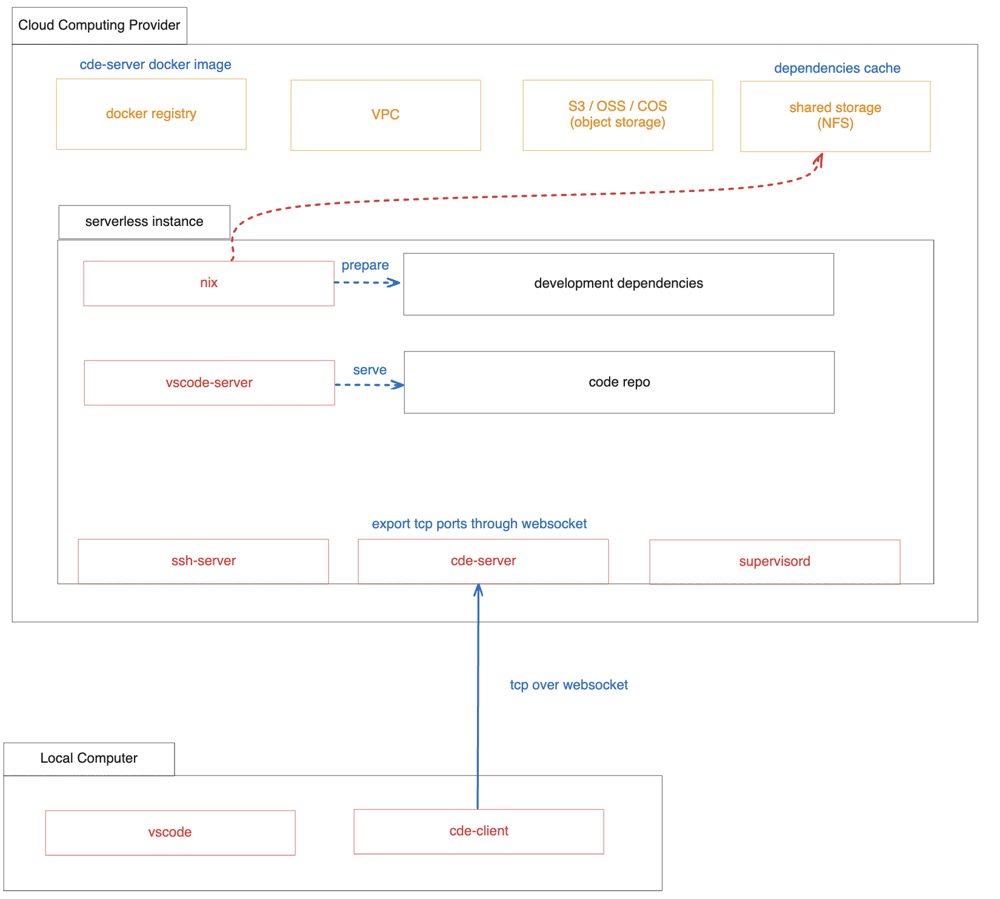
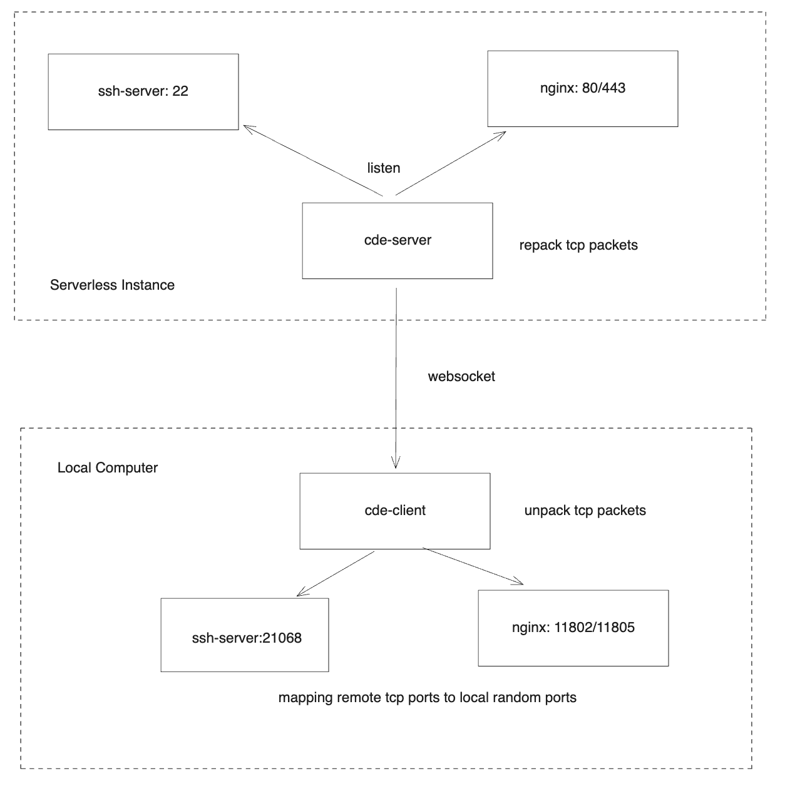

# vscode-cde

turn any serverless instance into a high performance server with GPU support

- 为本地电脑性能孱弱的开发者，提供短期高性能服务器
- 为企业中低频次 CI/CD 提供按量付费的选择（不用再维护一台专门的服务器做构建）

## 项目背景

### 热门项目快速试用
github 上每天都会涌现出一堆很有意思的项目，它们或者是某种新的大模型（语言、语音、图像），或是特定语言、架构下的库。在详细的 readme 介绍的加持下，我们能迅速理解大多数项目的目的，和其希望解决的问题。

但一些项目，不实际运行一下，是无法充分理解其特性的，尤其是各种大模型项目（例如各种微调的大模型），但其在配置的过程中，一般存在以下难点：

- 配置比较繁琐，尤其是对非后端从业者和学生
- 对本地电脑性能要求高，部分项目甚至需要至少 24GB 显存的 GPU
- 大部分项目仅作为选型参考，辛苦配置启动后，实际不会运行太长时间

### 小微企业持续集成
在云原生已深入千家万户的现在，也有很多企业挣扎在“上k8s都觉得奢侈”的境地，在项目构建、测试、发布上，或是在公司办公室内设置一台主机做持续集成，或是在云厂商租用一台小成本机器做构建发布，维护成本相对较高。

### 总结

针对以上问题，结合现在各家云厂商推出的 serverless 服务，我们开发了vscode-cde 项目，力求解决上述问题，并提供以下能力：

- 按需配置出一套任意 cpu/gpu/mem 组合的开发环境（暴露出22等端口），并能在本地的 vscode 中，通过 vscode-remote 独享该开发环境
- 秒级配置并启动出开发环境，即刻开启编码和运行
- 多云厂商支持（AWS/阿里云/腾讯云/Google Cloud），解决部分地区（主要是中国大陆）国际网络不通畅问题
- 通过共享的模版配置，一键启动热门项目
- 自定义模版，构筑专属开发环境，做项目编译/持续集成等

## 快速上手
在 release 页下载你的操作系统对应的 cde-client 二进制包，在shell执行

```
./cde-client --endpoint cde-server-edeirgdpjq.cn-hangzhou.fcapp.run --template ollama
```

上述指令会将函数计算实例的 ssh 端口转发到本地的随机端口，通过ssh连接该本地端口，即可拥有一台 4C8G with nvidia Tesla 16GB VRAM 的服务器，并安装了 ollama，你可以随意下载任意 ollama 支持的大模型，开始试验了。

> 注意：因 GPU 函数计算实例价格昂贵，目前设置每个实例最大连接时间为 10 分钟，以防开源把自己开破产🙏。

> 你可以在自己中意的云平台自己搭建函数计算实例，各个云厂商的函数计算搭建流程将会逐步完善在这里

## 项目架构



### serverless 改造

云厂商提供的 serverless 函数计算服务，主要是为了解决低频、高性能要求的任务，如网页转 pdf、视频 ffmpeg 截帧等场景，一般通过 MQ 或者 http 请求激活函数计算实例，任务执行完成后，返回结果并销毁实例，按照实际使用时间和计算资源量来进行计费。
我们设计了一套架构，将服务端的多路 tcp 端口，通过 websocket 转发到客户端程序所在电脑的本地端口，我们称其为“TCP Over Websocket With Multiplexing”



如上图所示，将函数计算实例中的 22 端口，通过 websocket 转发到本地的 21068 端口，则可以通过命令 

```shell
ssh -oPort=21068 root@localhost 
```
进入到函数计算实例中。

### 依赖管理

经过上一步的改造，我们成功的拥有了一个高性能服务器，但是当断开连接后，这个函数实例就会被销毁，我们在其中安装的依赖、下载的代码、模型也会随之消散，于是我们引入 nix 作为依赖管理器，并设置 nix 的软件包下载地址为云厂商提供的文件存储服务，如此一来，下次再需要使用相同依赖时，便不再需要重新下载，节省项目打开时间。

## 路线图

- [x] 通过 websocket 暴露出函数计算实例
- [ ] 使用 nix 管理依赖
- [ ] 各个云服务提供商搭建流程
- [ ] 将该项目适配企业 CI/CD workflow